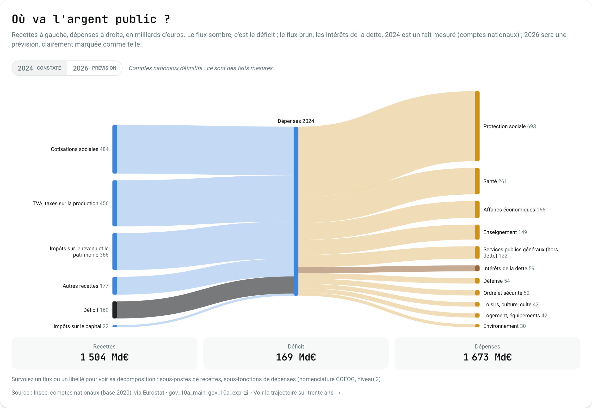
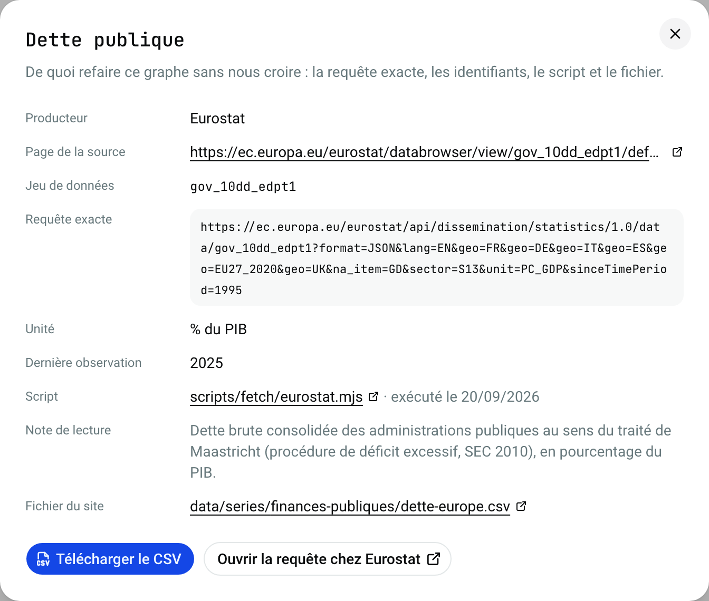
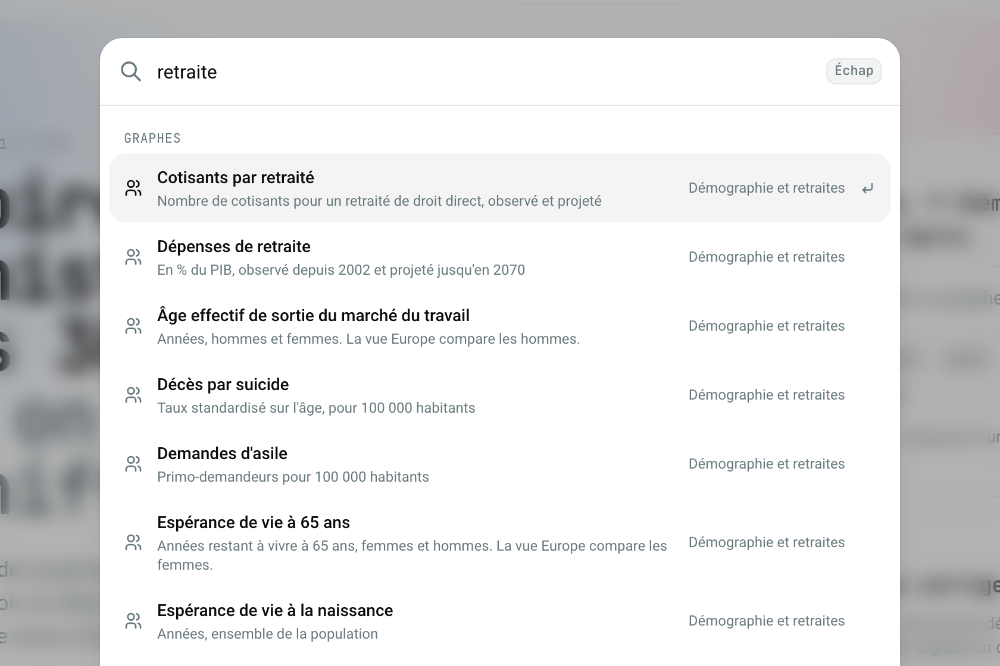
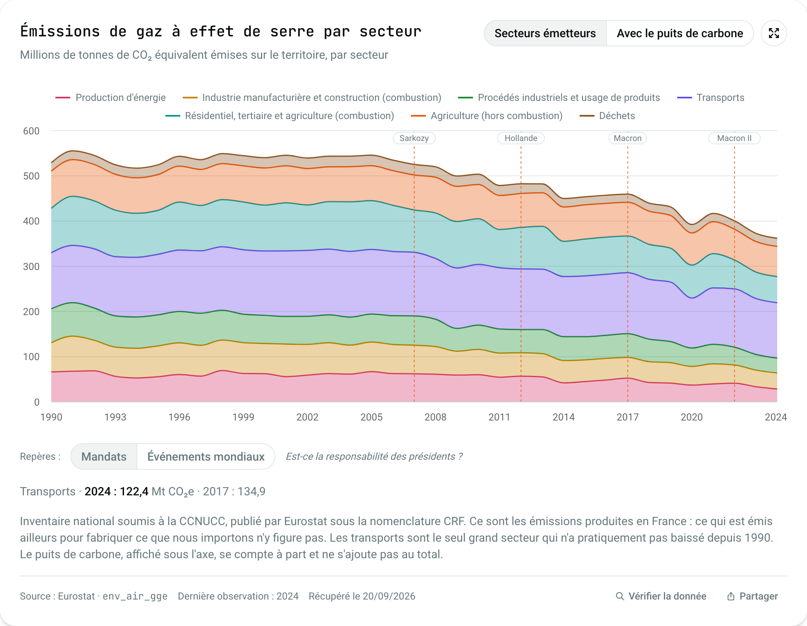
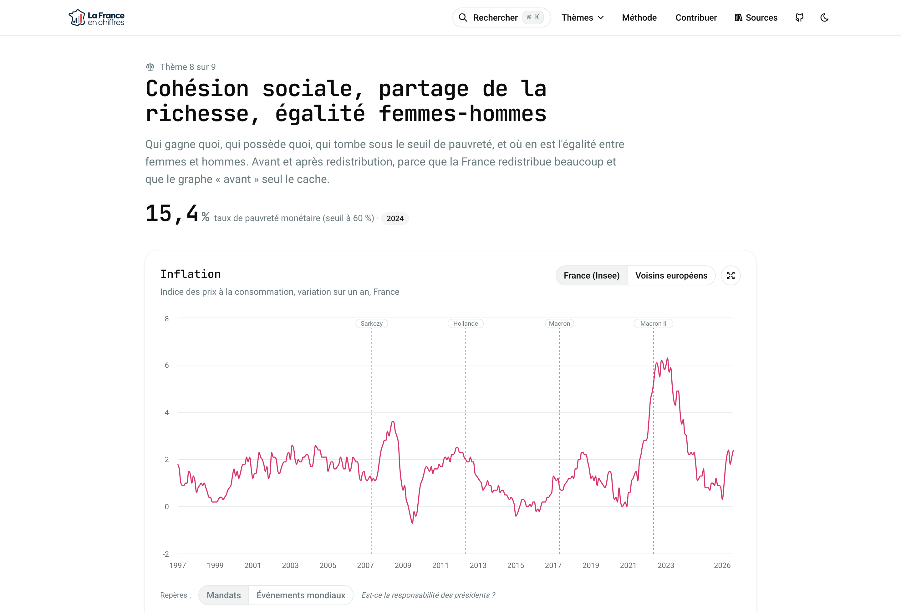

<p align="center">
  
  
</p>

<h1 align="center">La France en chiffres</h1>

<p align="center">
  <strong>Des statistiques publiques françaises, mises en perspective, et vérifiables une par une.</strong>
</p>

<p align="center">
  <a href="https://lafrance.enchiffres.fr"></a>
  
  
  
  
  
  <br>
  <a href="DATASETS.md"></a>
  <a href="DATASETS.md"></a>
  <a href="DATA-LICENSE.md"></a>
  
  <a href="LICENSE"></a>
  <a href="CONTRIBUTING.md"></a>
</p>

---

## Lien public

https://lafrance.enchiffres.fr

## Qu'est-ce que c'est

Un tableau de bord public de l'état de la France, construit à partir de séries émises par des producteurs publics ou académiques. Ce qui vocation a être important dans ce répo est que **chaque courbe vient d'une source officielle, citée et rejouable par n'importe qui.**

Ce que le site met en place pour qu'un chiffre se lise :

- **Des séries longues**, sur la profondeur que publie chaque source : souvent une trentaine d'années afin de pouvoir déceler des tendances.
- **Des pays de comparaison**, pour situer la France dans un contexte mondial.
- **Deux jeux de repères** au choix sur chaque graphe : les mandats présidentiels, ou les chocs qui ont touché le monde.

Les thèmes et les indicateurs ont été choisis arbitrairement et leur choix est clairement discutable : il se conteste dans une issue, selon la procédure de [GOVERNANCE.md](GOVERNANCE.md). L'objectif a été avant tout de chercher des sources neutres, légitimes et fiables venant d'entités gouvernementales ou organisations internationales reconues. 

## Quelques captures

| Accueil, avec la recherche | Recettes et dépenses publiques |
| --- | --- |
|  |  |

| « Vérifier la donnée » sous chaque graphe | Recherche plein texte |
| --- | --- |
|  |  |

| Un graphe : unité, repères, avertissements | Une page de thème |
| --- | --- |
|  |  |

## Les données sont dans le dépôt

Tout ce que les graphes affichent est versionné dans ce dépôt (80+ séries en CSV).

- **Rien n'est récupéré au build ni à l'affichage.** Les pages sont générées statiquement et lisent les CSV sur le disque. Une page ouverte ne va chercher aucune donnée ailleurs.
- **Les scripts de récupération ne tournent jamais tout seuls.** `npm run refresh` et `npm run manual` sont lancés à la main quand une source publie une nouvelle édition. Les CSV réécrits sont commités ce qui permet de voir les différences avec un diff.
- **Un rafraîchissement qui ne change rien ne produit pas de diff.** `fetchedAt` n'est réécrit que si les valeurs ont bougé.

### D'où viennent les données

| Mode | Comment | Exemples |
| --- | --- | --- |
| **Automatique** | Un script de `scripts/fetch/` appelle l'API du producteur et écrit le CSV, les métadonnées et un rapport de récupération. | Eurostat, Insee, OCDE, FMI, Our World in Data, DREES, CNAF, SSMSI |
| **Fichier versionné** | Le producteur ne publie qu'un classeur ou des exports. Le fichier est versionné dans `data/sources-manuelles/`, un script de `scripts/manual/` le relit et en extrait les séries. | Conseil d'orientation des retraites, World Inequality Database, PISA, DEPP |

Aucun chiffre n'est saisi à la main, jamais recopié d'un article. Chaque série porte son producteur, l'identifiant du jeu, **la ou les requêtes exactes**, son unité, sa dernière observation, sa licence et sa date de récupération. Le bouton « Vérifier la donnée » sous chaque graphe rejoue cette requête chez le producteur.

Deux fichiers sources sont trop volumineux pour être redistribués : leur adresse et la façon de les obtenir sont décrits dans [DATA-LICENSE.md](DATA-LICENSE.md).

## Stack

| Couche | Choix | Version |
| --- | --- | --- |
| Framework | [Next.js](https://nextjs.org) App Router, React Server Components, Turbopack | 16.3 / React 19.2 |
| Interface | [shadcn/ui](https://ui.shadcn.com) preset `base-luma` sur [Base UI](https://base-ui.com), Tailwind CSS, icônes Tabler, JetBrains Mono + Roboto | Tailwind 4 |
| Graphes | [Recharts](https://recharts.org) — lignes, aires empilées, Sankey | 3 |
| Thème clair / sombre | [next-themes](https://github.com/pacocoursey/next-themes) | 0.4 |
| Données | fichiers CSV et JSON lus au build, aucune base de données | — |
| Hébergement | [Vercel](https://vercel.com), pages statiques, région de Paris | — |

Ce site ne comporte pas de base de données, ou de service tiers appelé depuis le navigateur. Il n'y a donc aucun cookie et aucune mesure d'audience (voir les [mentions légales](https://lafrance.enchiffres.fr/mentions-legales)).

## Démarrer en local

Prérequis : Node.js 22 ou plus.

```bash
git clone https://github.com/jbernales5/lafrance-enchiffres && cd lafrance-enchiffres
npm install
npm run dev          # http://localhost:3000
```

| Commande | Effet |
| --- | --- |
| `npm run dev` | serveur de développement |
| `npm run validate` | vérifie le contrat de `data/` — exécuté avant chaque build |
| `npm run typecheck` | `tsc --noEmit` |
| `npm run build` / `npm start` | build de production, puis serveur |
| `npm run refresh` | rejoue toutes les sources qui ont une API et réécrit les CSV |
| `npm run refresh eurostat` | rejoue un seul producteur |
| `npm run manual` | reconstruit les séries issues de `data/sources-manuelles/` |
| `npm run format` | Prettier — la CI vérifie le formatage |

> [!NOTE]
> ESLint 10 plante dans le plugin React du preset shadcn. Ce n'est pas le code du projet : `npm run validate`, le typecheck et le build font foi. L'API SDMX de l'OCDE applique par ailleurs un quota par adresse IP : enchaîner les `npm run refresh` déclenche des 429.

## Contribuer

Tout le monde est bienvenu, quel que soit son bord. La seule question posée à une proposition de série est : **existe-t-il une source primaire qui publie cette donnée, sous une licence qui en autorise la redistribution ?**

- **Un chiffre vous semble faux** — ouvrez une issue « Erreur de donnée ». Le bouton « Vérifier la donnée » donne la requête exacte à comparer. La procédure est dans [docs/CORRECTIONS.md](docs/CORRECTIONS.md).
- **Un graphe vous semble orienté** — ouvrez une issue « Désaccord de méthode » en disant quel indicateur serait plus juste et d'où il vient.
- **Vous avez une donnée à rajouter** — via Pull Request vous pouvez rajouter un script, un CSV et/ou un fichier de métadonnées.

La marche à suivre est dans [CONTRIBUTING.md](CONTRIBUTING.md), les règles complètes dans [AGENTS.md](AGENTS.md), et les échanges sont régis par le [code de conduite](CODE_OF_CONDUCT.md).

### Pour les agents

Ce dépôt est pensé pour être modifié aussi bien par des humains que par des agents. **[`AGENTS.md`](AGENTS.md) est le document normatif** : il contient les règles, ce que la vérification automatique refuse, et la marche à suivre pour ajouter une série. [`CLAUDE.md`](CLAUDE.md) donne la carte du code et les pièges d'outillage.

## Structure

```
app/                     App Router
  page.tsx               accueil : hero, recherche, diagramme du budget, bandes de thèmes
  [slug]/                une page par thème
  methode/               comment les données sont choisies, vérifiées et mises en perspective
  contribuer/            comment proposer une donnée, et ce qui manque encore
  a-propos/              qui porte le projet, ce qu'il fait et ce qu'il ne fait pas
  mentions-legales/      éditeur, hébergeur, données personnelles, licences
  series/                téléchargement d'une série en CSV, avec sa provenance en tête
components/
  charts/                chart-block (enveloppe), time-chart (tracé), sankey-block, budget-sankey
  site/                  en-tête, recherche ⌘K, dialogues, pied de page
  ui/                    composants shadcn (réinstaller, ne pas éditer à la main)
lib/
  catalog.ts             lecture et mise en cache des données au build
  series-colors.ts       une couleur par entité, projections en pointillé
  mandates.ts            repères « mandats » et « événements mondiaux »
  search.ts              index de recherche, construit depuis le catalogue
  sources.ts             index des sources, pour la page Méthode et le dialogue « Sources »
data/
  licenses.json          catalogue des licences, par producteur
  categories/*.json      un thème : titre, chapô, chiffre-clé, graphes déclarés
  series/**/*.csv        les valeurs, format long : period,series,value
  series/**/*.meta.json  provenance, unité, libellés, licence
  series/*-REPORT.md     rapports de récupération, un par producteur
  sources-manuelles/     fichiers que relisent les scripts de scripts/manual/
  README.md              le contrat de données, en détail
scripts/
  lib/                   socle partagé : écriture atomique, reprise réseau, normalisation des sources
  fetch/                 récupération depuis une API, un script par producteur
  manual/                reconstruction depuis un fichier versionné
  validate.mjs           le contrat de données, exécuté avant chaque build
docs/screenshots/        les captures de ce README
```

## Licence

Le code est sous licence **MIT** : voir [LICENSE](LICENSE).

**Les données ne sont pas couvertes par cette licence.** Elles appartiennent à leurs producteurs et restent soumises à leurs conditions de réutilisation, détaillées producteur par producteur dans [DATA-LICENSE.md](DATA-LICENSE.md) et rappelées dans « Vérifier la donnée » sur chaque graphe. Les CSV téléchargés depuis le site portent leur source, leur licence et l'attribution demandée en tête de fichier.

Si vous êtes producteur d'une des sources utilisées et que cette redistribution vous pose problème n'hésitez pas à ouvrir une issue pour que l'on apporte les modifications nécessaires.

<p align="center">
  <sub>Fait avec ♥ par <a href="https://github.com/jbernales5">Jonathan Bernales</a> et les contributeurs.</sub>
</p>
